# Manual - Digital Menu and Polling System

## Team: BSIT-4
*   **Almaden, Justine Jude**
*   **Abrea, Jude Ivan**
*   **Cananca, Mark Jovan**
*   **Marte, John Zeus**
*   **Del Monte, Reiner**

**SY 2025-2026**

---

## System Setup

The system has been fully configured for online deployment and can be accessed through the following URL: [sisigan-ni-kuya-moy.vercel.app](https://sisigan-ni-kuya-moy.vercel.app).

The frontend of the system is hosted on **Vercel**, ensuring fast and reliable access from any device, while the backend services and database are powered by **Supabase**, which provides secure data storage and API management.

For any inquiries, technical issues, or requests related to the backend, hosting, or general functionality of the system, please contact the development team.

---

## System Features

### 1. Landing Page (User-Facing)
*   **Recommended Menu Display**: Highlights dishes recommended by the admin. Attractive visuals for popular or seasonal dishes.
*   **Promo Poll**: Users can vote on promotions or dishes for discounts. Shows active polls and results.
*   **Messaging**: Users can send messages/feedback directly to the admin. Simple form with optional attachments (if needed).
*   **Digital Menu**: Displays all available dishes. Shows dish details (name, description, price, availability, images).

### 2. Admin Dashboard
*   **Overview Page**: Quick summary of Total dishes, Total visits/views, New messages, Active polls.
*   **Recommended Dishes**: Ability to select dishes to feature on the landing page.
*   **Message Management**: View and respond to customer messages.
*   **Menu Management**: Add, edit, or remove dishes from the menu. Set availability (days, stock status).
*   **Poll Management**: Create polls for promos or dish requests. End or manage active polls. View poll results and winning dishes.

---

# User Guide

## Logging in
The login page is found at [https://sisigan-ni-kuya-moy.vercel.app/login](https://sisigan-ni-kuya-moy.vercel.app/login).
This requires an admin account that is supplied by the developers.

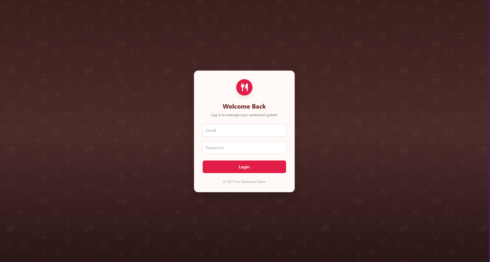

## Main Page
The landing page is the main area that visitors will see. This includes the E-Menu, Polling, and Suggestions.
The URL is found at [https://sisigan-ni-kuya-moy.vercel.app/](https://sisigan-ni-kuya-moy.vercel.app/).

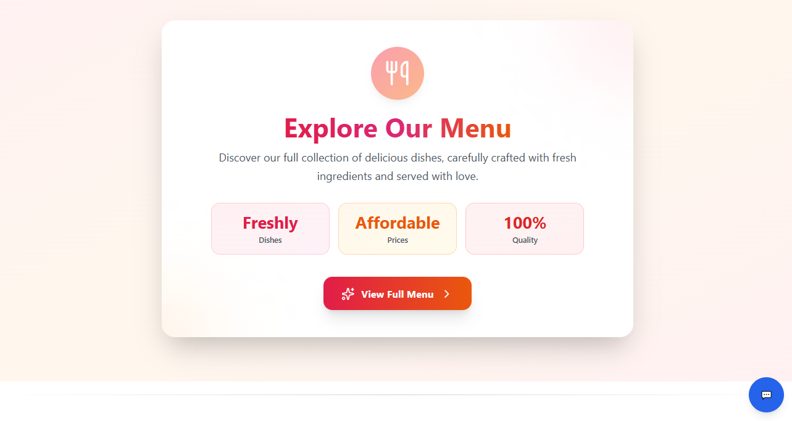
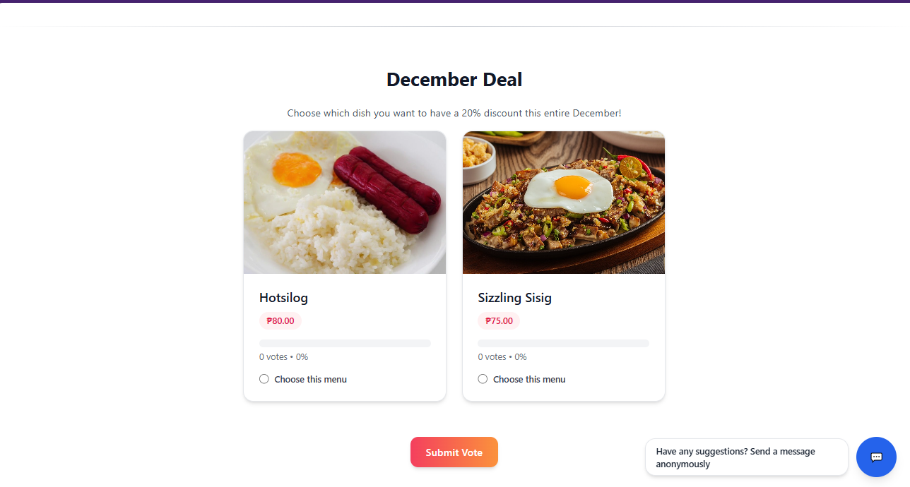
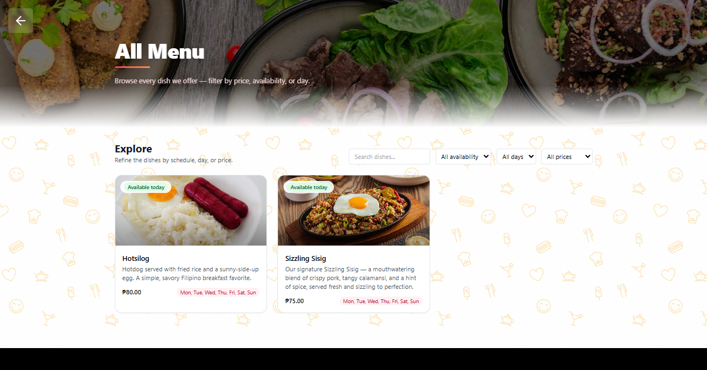

*(E-Menu)*

## Dashboard
The dashboard displays data for your dishes, page visits and messages. Users can redirect to view the Main Landing page and E-Menu From here.

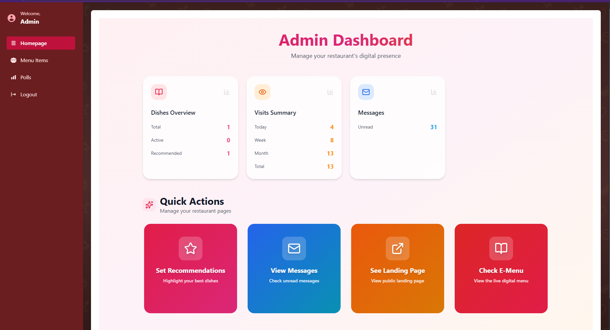

*   **Set Recommendation** – Select the menu you want to highlight on the landing page.
*   **See Landing page** – View the landing page that visitors see.
*   **Check E-Menu** – View the e-menu.
*   **View Messages** – See the messages that people send from the landing page.

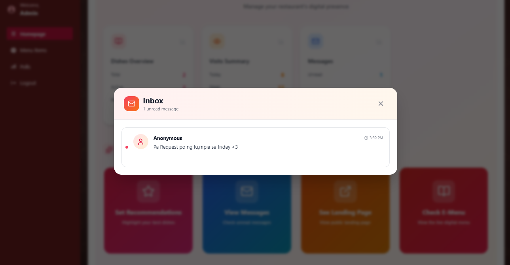

## Setting up your menu
To set up your menu, go to the menu section where you can add/edit existing dishes.
Click the **add new dish** button to create a new dish.

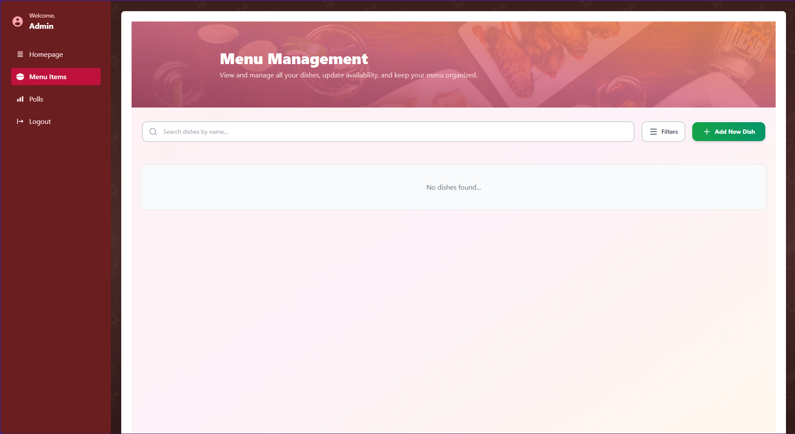
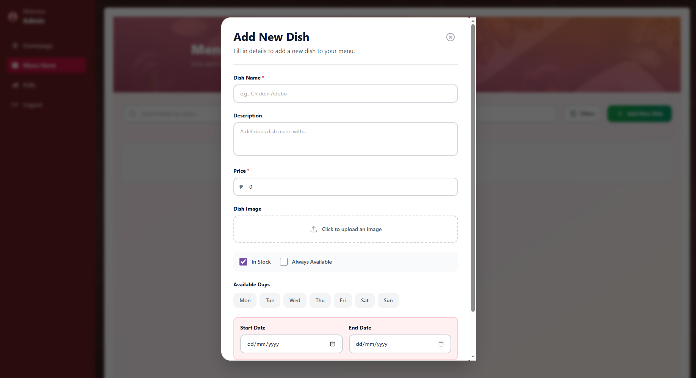

## Setting up a poll
To set up a poll, open the poll menu. Press "**create new poll**" on the top right of the screen.

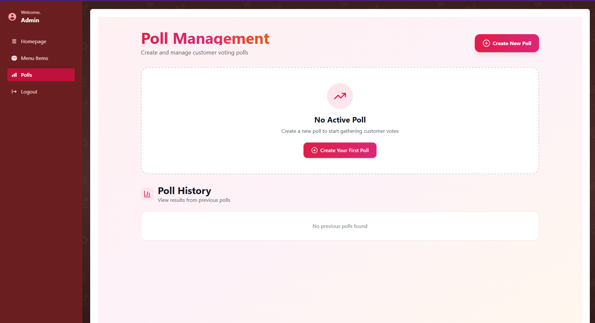

Enter the poll title, Description, from and to range, and select the dishes you want to include for it.

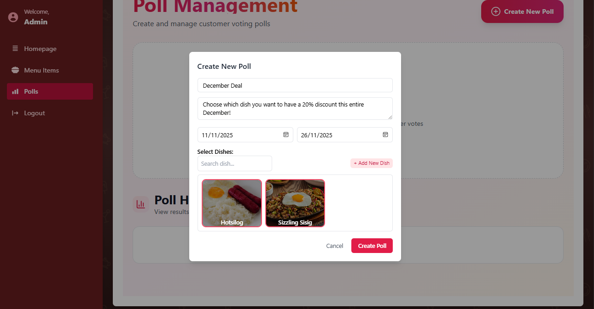

**Note:** There can only be one active poll running at a time. An ongoing poll can be ended early at any time.

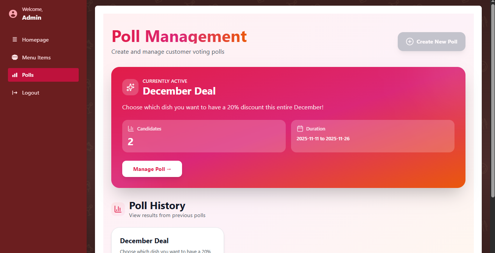
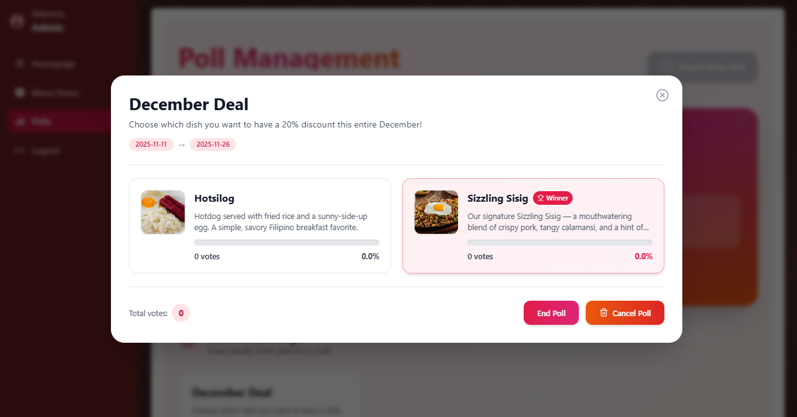
